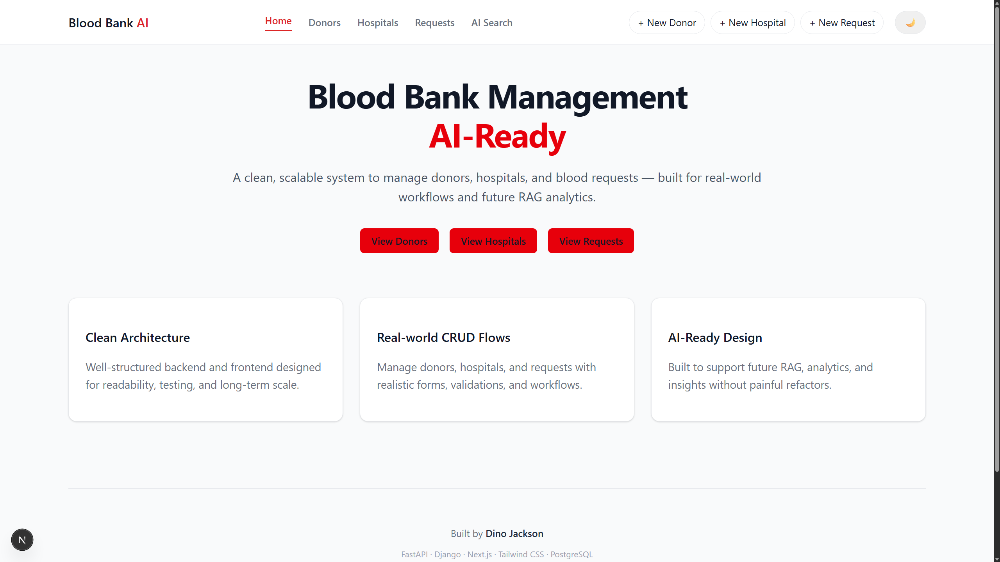

# Blood Bank RAG AI
> A full-stack Django + Next.js app demonstrating explainable RAG-style semantic search over healthcare-style data.

Blood Bank RAG AI is a full-stack application that enables natural language semantic search
over donors, hospitals, and blood requests using a lightweight RAG-style architecture.
It is designed to demonstrate real-world AI retrieval behavior in a safe, explainable,
and recruiter-friendly way.

---

## Motivation

In healthcare-style systems, strict SQL filters are precise but fragile for natural language,
while pure semantic systems can return misleading results. This project demonstrates a
practical middle ground: semantic retrieval augmented with structured metadata so results
remain relevant, auditable, and predictable.

---

## Table of Contents

- [Project Overview](#project-overview)
- [Architecture](#architecture)
- [Core Entities](#core-entities)
- [Key Files and Responsibilities](#key-files-and-responsibilities)
- [Features](#features)
- [Semantic Search Behavior](#semantic-search-behavior)
- [Screenshots](#screenshots)
- [Quickstart](#quickstart)
- [Testing](#testing)
- [Limitations](#limitations)
- [Why This Project Matters](#why-this-project-matters)
- [License](#license)

---

## Project Overview

Traditional dashboards require users to manually filter data.
This project introduces an AI-powered semantic search layer that understands intent
across multiple entities:

- Donors
- Hospitals
- Blood Requests

Example queries:
- find O+ donors in Udaipur
- large hospitals with high capacity
- urgent O- blood requests
- donors near hospitals with pending requests

When no meaningful match exists, the system returns a clear
"No relevant results" response.

---

## Architecture

### Backend
- Django 5 + Django REST Framework
- REST APIs for Donors, Hospitals, and Requests
- Dedicated AI semantic search endpoint

### Frontend
- Next.js (App Router)
- Tailwind CSS
- Clean dashboard UI with natural language search

### Vector Layer
- MongoDB used as a lightweight vector store
- Each vector stores:
  - Embedding
  - Entity type
  - Entity ID
  - Structured metadata (age, blood group, city, capacity, status, contact)

### AI Layer
- sentence-transformers (`all-MiniLM-L6-v2`)
- Cosine similarity–based retrieval
- Deterministic summaries (no generative hallucination)

---

## Core Entities
- Donor: name, age, blood group, contact, city
- Hospital: name, location, contact, capacity
- Request: patient details, blood group, hospital, units, status

---

## Key Files and Responsibilities

The backend is structured to keep CRUD logic, AI logic, and infrastructure concerns clearly separated.

- `core/models.py`  
  Defines core domain models: **Donor**, **Hospital**, and **Request**.

- `core/serializers.py`  
  API serializers with read/write separation (Request returns hospital name for reads and accepts hospital_id for writes)

- `core/views.py`  
  Standard CRUD viewsets and a health-check endpoint.

- `core/views_ai.py`  
  AI semantic search endpoint (`POST /api/ai/search/`) responsible for query handling, vector retrieval, and summary generation.

- `core/utils.py`  
  AI utilities including `generate_embedding`, `vector_search`, `vector_insert`, and deterministic `llm_summarize`.

- `core/mongo.py`  
  Lightweight MongoDB-based vector storage and similarity search implementation.

- `core/management/commands/ingest_vectors.py`  
  Management command to ingest relational data into the vector store with structured metadata.

- `core/tests.py`  
  Unit tests covering models, API endpoints, and AI search behavior (using mocks for deterministic results).


## Features

- CRUD APIs for donors, hospitals, and blood requests
- Natural language semantic search across all entities
- Cross-entity reasoning (donors, hospitals, requests)
- Ranked results with relevance scores
- Deterministic AI summary highlighting top match
- Explicit "No results" response when no meaningful match exists
- Local embeddings with no external paid APIs

---

## Semantic Search Behavior

This project intentionally does not behave like strict filtering.

Example:
Query: show donors aged 25

Result:
- May include donors aged 22, 25, 27, etc.
- Ranked by contextual relevance rather than exact equality

Reason:
- This is semantic retrieval, not SQL filtering
- Numeric fields act as semantic signals
- This mirrors real production AI search systems

For strict filtering, traditional REST endpoints should be used instead.

---

## Screenshots

Below are real screenshots from the running application.

### 1. Landing Page Dashboard
Home page with navigation and system overview.



---

### 2. Donors Table
CRUD dashboard showing donor records.


---

### 3. Hospitals Table
Hospital management dashboard with capacity data.


---

### 4. Requests Table
Blood request records with status tracking.


---

### 5. AI Search Empty State
AI search page before running any query.


---

### 6. AI Search Donor Query
Query: `find O+ donors in Udaipur`  
Semantic match with ranked donor results.


---

### 7. AI Search Hospital Capacity
Query: `large hospitals with high capacity`  
Concept-based reasoning over hospital data.


---


## Quickstart


### Backend (Django + AI Search)

```bash
# Clone the repository
git clone https://github.com/dno-j/bloodbank-rag-ai.git
cd bloodbank-rag-ai/backend

# Create virtual environment
python -m venv .venv

# Activate virtual environment
# Windows PowerShell
.venv\Scripts\Activate.ps1

# macOS / Linux
# source .venv/bin/activate

# Install dependencies
pip install -r requirements.txt

# Run database migrations
python manage.py migrate

# Ingest relational data into the vector store
python manage.py ingest_vectors

# Start the backend server
python manage.py runserver
```

Backend will be available at:

```
http://127.0.0.1:8000
```

---

### Frontend (Next.js)

```bash
cd ../frontend

# Install dependencies
npm install

# Start development server
npm run dev
```

Frontend will be available at:

```
http://localhost:3000
```

---

### Environment Variables

Create a local environment file for the frontend:

```bash
cp .env.example .env.local
```

Example content:

```env
NEXT_PUBLIC_API_BASE=http://127.0.0.1:8000/api
```

---

## Testing

Run backend tests:

```
python manage.py test core
```

Tests cover:
- Model behavior
- API endpoints
- AI search edge cases
- Semantic versus strict matching behavior

---

## Limitations

- AI summaries are deterministic, not generative chat
- Vector search is lightweight (MongoDB, not FAISS or Pinecone)
- Designed for demos, learning, and interviews, not medical production use

---

## Why This Project Matters

This project demonstrates:
- Practical RAG architecture
- Safe and explainable AI behavior
- Clear separation between AI search and CRUD logic
- Realistic expectations of semantic search systems
- Strong full-stack engineering fundamentals

The system is built to be auditable, explainable, and interview-ready.

---

## License

MIT License
